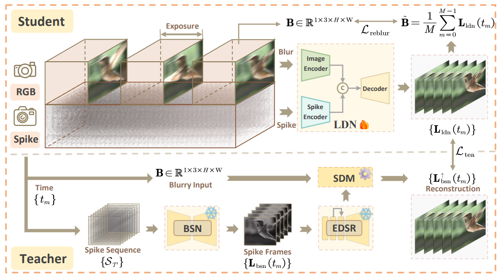
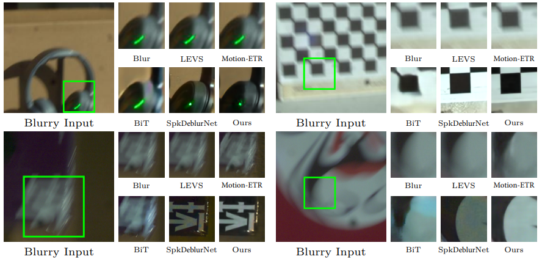

<h2 align="center"> 
  <a href="https://arxiv.org/abs/2403.09486">SpikeReveal: Unlocking Temporal Sequences from Real Blurry Inputs with Spike Streams</a>
</h2>
<h5 align="center"> 
If you like our project, please give us a star ⭐ on GitHub.  </h5>
<h5 align="center">

[](https://arxiv.org/abs/2403.09486)
[](https://github.com/chenkang455/S-SDM)
[](https://github.com/chenkang455/S-SDM/stargazers)&#160;

</h5>

<p align="center">
  Implementation of "SpikeReveal: Unlocking Temporal Sequences from Real Blurry Inputs with Spike Streams".
  
</p>


## 📕 Abstract
> We begin with a theoretical analysis of the relationship between spike streams, blurry images, and sharp sequences, leading to the development of our Spike-guided Deblurring Model (SDM). We further construct a self-supervised processing pipeline by cascading the denoising network and the super-resolution network to reduce the sensitivity of the SDM to spike noise and its reliance on spatial-resolution matching between the two modalities. To reduce the time consumption and enhance the utilization of spatial-temporal spike information within this pipeline, we further design a Lightweight Deblurring Network (LDN) and train it based on pseudo-labels from the teacher model, i.e., the established self-supervised processing pipeline. By further introducing re-blurring loss during LDN training, we achieve better restoration performance and faster processing speed compared to the processing-lengthy and structure-complicated teacher model.

## 👀 Visual Comparisons
<details open>
<summary><strong>Sequence reconstruction on RSB dataset under different light conditions.</strong> (flicker is caused by the gif compression)</summary>
<p align="center">


</p>
</details>


<details open><summary><strong>Image debluring on RSB Dataset.</strong></summary>
<p align="center">

</p>
</details>


## 🗓️ TODO
- [x] Release the scripts for simulating GOPRO dataset.
- [x] Release the training and testing code.
- [x] Release the pretrained model.
- [x] Release the synthetic/real-world dataset.

## 🕶 Dataset

Guidance on synthesizing the spike-based GOPRO dataset can be found in [GOPRO_dataset](scripts/GOPRO_dataset.md). 

Converted GOPRO dataset can be found in [GOPRO](https://pan.baidu.com/s/1ZvRNF4kqVB8qe1K78hmnzg?pwd=1623) and the real-world blur RSB dataset will be public once our manuscript is accepted.

## 🍭 Prepare
Our S-SDM requires the sequential training of BSN, EDSR and LDN respectively. We provide the trained weights through the [link](https://pan.baidu.com/s/1FGqlMFtnL5jwI39I5mNkTw?pwd=1623), which should be placed in the folder `model/`. Meanwhile, downloaded/converted GOPRO dataset should be located under the `project root` folder. The structure of our project is formulated as:
```
<project root>
├── codes
├── imgs
├── log (train and evaluation results)
├── model
│   ├── BSN_1000.pth
│   └── ...
├── scripts
├── GOPRO
│   ├── test
│   └── train
├── train_bsn.py
├── train_deblur.py
└── train_sr.py
``` 

## 🌅 Train

Train BSN on the GOPRO dataset:
```
python train_bsn.py --base_folder GOPRO/ --bsn_len 9 --data_type GOPRO 
```

Train EDSR  on the GOPRO dataset:
```
python train_sr.py --base_folder GOPRO/ --data_type GOPRO
```

Train LDN  on the GOPRO dataset:
```
python train_deblur.py --base_folder GOPRO/ --bsn_path model/BSN_1000.pth  --sr_path model/SR_70.pth  --lambda_reblur 100 --data_type GOPRO 
```

## 📊 Evaluate

Evaluate BSN on the GOPRO dataset:
```
python train_bsn.py --test_mode --bsn_path model/BSN_1000.pth --data_type GOPRO
```

Evaluate EDSR on the GOPRO dataset:
```
python train_sr.py --test_mode --bsn_path model/BSN_1000.pth  --sr_path model/SR_70.pth --data_type GOPRO
```

Evaluate LDN on the GOPRO dataset:
```
python train_deblur.py --test_mode --bsn_path model/BSN_1000.pth  --sr_path model/SR_70.pth --deblur_path model/DeblurNet_100.pth --data_type GOPRO
```

## 📞 Contact
Should you have any questions, please feel free to contact [mrchenkang@whu.edu.cn](mailto:mrchenkang@whu.edu.cn).

## 🤝 Citation
If you find our work useful in your research, please cite:

```
@article{chen2024spikereveal,
  title={SpikeReveal: Unlocking Temporal Sequences from Real Blurry Inputs with Spike Streams},
  author={Chen, Kang and Chen, Shiyan and Zhang, Jiyuan and Zhang, Baoyue and Zheng, Yajing and Huang, Tiejun and Yu, Zhaofei},
  journal={arXiv preprint arXiv:2403.09486},
  year={2024}
}
```
